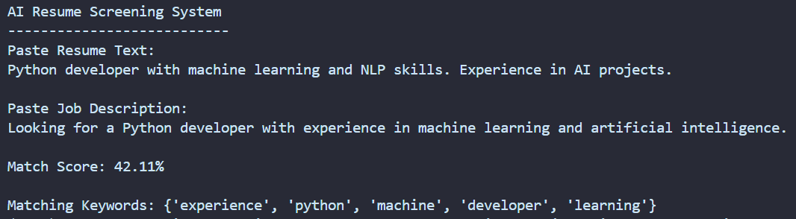
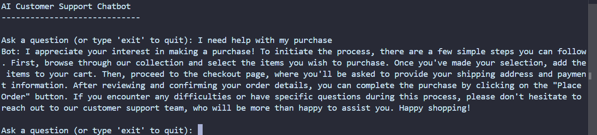
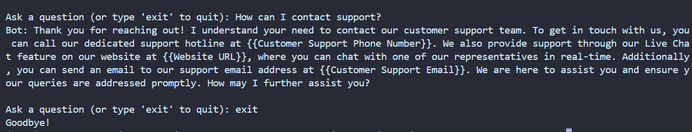

# AI Projects – Resume Screening System & Customer Support Chatbot

## Overview
This repository contains two Artificial Intelligence projects developed as part of the Artificial Intelligence Internship at SoftGrowTech. 
These projects demonstrate the practical application of Natural Language Processing (NLP) in real-world domains such as recruitment and customer support.

---

## Project 1: AI Resume Screening System

### Description
The AI Resume Screening System analyzes a candidate’s resume and compares it with a job description to determine how well the candidate matches the job requirements.

### Features
- Accepts resume text and job description
- Calculates similarity using TF-IDF and cosine similarity
- Displays match score
- Extracts matching keywords

### How It Works
1. Input resume and job description
2. Convert text into vectors using TF-IDF
3. Calculate similarity using cosine similarity
4. Output match score and matching keywords

### Example Output
Match Score: 78.45%  
Matching Keywords: python, machine, learning, data  

### Screenshots

### Files
- resume_matcher.py → main code
- sample_resume.txt → sample resume
- sample_job_desc.txt → sample job description

---

## Project 2: AI Chatbot for Customer Support

### Description
This project is an AI-based chatbot that answers customer queries automatically using Natural Language Processing techniques.

### Features
- Accepts user queries
- Matches questions using TF-IDF
- Returns relevant responses
- Handles unknown queries with fallback response

### How It Works
1. Loads dataset containing questions and responses
2. Converts text into vectors using TF-IDF
3. Compares user input using cosine similarity
4. Returns best matching response

### Screenshots
  

### Files
- chatbot.py → main code
- faq_dataset.csv → dataset
- sample_queries.txt → test queries

---

## Technologies Used
- Python  
- pandas  
- scikit-learn  
- Natural Language Processing (NLP)  
- TF-IDF Vectorization  
- Cosine Similarity  

---

## How to Run

Install dependencies:
pip install -r requirements.txt

Run Resume Screening System:
python resume_matcher.py

Run Chatbot:
python chatbot.py

---

## Internship Details
Intern Name: Michelle De Melo  
Program: Artificial Intelligence Internship  
Organization: SoftGrowTech  

---

## Author
Michelle De Melo  

---

## Acknowledgment
I would like to express my sincere gratitude to SoftGrowTech for providing me with the opportunity to work on this Artificial Intelligence Internship 
and develop practical projects in the field of NLP. This experience has helped me enhance my understanding of real-world AI applications. 
I would also like to thank the mentors and support team for their guidance and encouragement throughout the internship, which contributed significantly 
to the successful completion of these projects.
